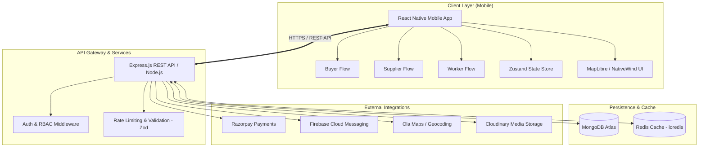

<div align="center">

# 🏗️ ConstiGo

### **Next-Gen On-Demand Construction Materials & Services Marketplace**

[](https://reactnative.dev/)
[](https://www.typescriptlang.org/)
[](https://nodejs.org/)
[](https://expressjs.com/)
[](https://www.mongodb.com/)
[](https://redis.io/)
[](https://www.nativewind.dev/)
[](https://razorpay.com/)
[](LICENSE)

<p align="center">
  <b>ConstiGo</b> bridges the gap between contractors, builders, material suppliers, and skilled workers with hyper-local geolocation discovery, real-time tiered pricing, instant order fulfillment, and verified marketplace reliability.
</p>

[Key Features](#-key-features) •
[System Architecture](#-system-architecture) •
[Tech Stack](#-tech-stack) •
[Project Structure](#-project-structure) •
[Getting Started](#-getting-started) •
[API Reference](#-api-reference) •
[Contributing](#-contributing)

---

</div>

## 📖 Table of Contents

- [Overview](#-overview)
- [Key Features](#-key-features)
  - [Buyer & Contractor Portal](#1-buyer--contractor-portal)
  - [Supplier & Merchant Hub](#2-supplier--merchant-hub)
  - [Worker & Labor Marketplace](#3-worker--labor-marketplace)
- [System Architecture](#-system-architecture)
- [Tech Stack](#-tech-stack)
- [Repository Structure](#-project-structure)
- [Environment Variables](#-environment-variables)
- [Getting Started](#-getting-started)
  - [Prerequisites](#prerequisites)
  - [1. Backend Setup](#1-backend-setup)
  - [2. Mobile App Setup (Android / iOS)](#2-mobile-app-setup)
- [Database Seeding](#-database-seeding)
- [API Overview](#-api-reference)
- [Roadmap](#-roadmap)
- [Contributing](#-contributing)
- [License](#-license)

---

## 🌟 Overview

The construction material procurement supply chain is traditionally fragmented with manual phone calls, untracked logistics, opaque pricing, and delays.

**ConstiGo** is a full-stack, end-to-end B2B/B2C ecosystem providing:
1. **Hyper-local Supplier Discovery**: Discover nearby verified brick kilns, cement dealers, steel fabricators, and aggregate quarries on an interactive map.
2. **Dynamic Bulk Pricing & Direct Ordering**: Order in bags, tons, truckloads, or custom units with instant rate computation.
3. **End-to-End Order Tracking**: Milestone-driven status progression (`PENDING` → `ACCEPTED` → `DISPATCHED` → `DELIVERED`).
4. **Digital Payments & Escrow**: Native integration with Razorpay (Cards, UPI, NetBanking) and Cash on Delivery (COD).

---

## ✨ Key Features

### 1. Buyer & Contractor Portal
- 📍 **Map-Based Discovery**: Interactive geospatial map with custom markers using **MapLibre** and **Ola Maps**.
- 🧱 **Material Catalog**: Categorized catalog for Cement, TMT Steel, Red Bricks, River Sand, Aggregates, Plumbing, and Electrical supplies.
- 🛒 **Intelligent Cart**: Multi-supplier cart validation, dynamic unit pricing, and quantity adjustments.
- 📌 **Address Book & Geocoding**: Saved site addresses with pin-drop coordinate pinpointing.
- 💳 **Seamless Checkout**: Dual payment channels (Razorpay Payment Gateway & COD) with instant payment signature verification.
- 📦 **Live Order Tracking**: Visual order timeline with delivery milestones, driver dispatch status, and order invoices.
- ❤️ **Favorites & Wishlist**: Bookmark frequently purchased construction materials for quick reordering.
- 🔔 **Instant Push Notifications**: Push updates powered by Firebase Cloud Messaging (FCM).

### 2. Supplier & Merchant Hub
- 🏢 **Supplier Onboarding & KYC**: Business registration, company details, GSTIN, and location geofencing.
- 📊 **Real-time Inventory Management**: Add, update, and manage products with high-resolution photos, stock alerts, and grade specifications (e.g., Grade A, Fe 550D).
- ⚡ **Availability Toggles**: One-tap toggle to mark materials as in-stock or out-of-stock.
- 📋 **Order Dispatch Lifecycle**: Accept incoming site requests, assign logistics, and mark items dispatched.
- 📈 **Business Insights & Support**: Overview of order volume, revenue metrics, customer reviews, and direct merchant support.

### 3. Worker & Labor Marketplace
- 👷 **Skill Registration**: Masons, carpenters, plumbers, electricians, bar benders, and general helpers.
- 💼 **Daily Wage Quotations**: Transparent per-day wage rates and geographic service radiuses.

---

## 🏗️ System Architecture



---

## 🛠️ Tech Stack

### **Mobile Client (`/mobile`)**
| Layer | Technology |
| :--- | :--- |
| **Framework** | [React Native 0.86](https://reactnative.dev/) (New Architecture ready) |
| **Language** | [TypeScript 5.8](https://www.typescriptlang.org/) |
| **Styling** | [NativeWind v4](https://www.nativewind.dev/) (Tailwind CSS v3 engine) |
| **State Management** | [Zustand](https://github.com/pmndrs/zustand) (Modular DDD application stores) |
| **Navigation** | [React Navigation v7](https://reactnavigation.org/) (Native Stack & Bottom Tabs) |
| **Maps & GIS** | [@maplibre/maplibre-react-native](https://maplibre.org/) & Ola Maps API |
| **Payment Gateway** | [react-native-razorpay](https://razorpay.com/docs/payments/payment-gateway/react-native-integration/) |
| **Forms & Validation** | [React Hook Form](https://react-hook-form.com/) + [Zod](https://zod.dev/) |
| **Typography** | Baloo Bhai 2, Montserrat, React Native Vector Icons |

### **Backend Server (`/backend`)**
| Layer | Technology |
| :--- | :--- |
| **Runtime & Language** | [Node.js v20+](https://nodejs.org/) & [TypeScript](https://www.typescriptlang.org/) (ES Modules) |
| **Web Framework** | [Express.js](https://expressjs.com/) |
| **Database** | [MongoDB](https://www.mongodb.com/) with [Mongoose ODM](https://mongoosejs.com/) (2dsphere geospatial indexing) |
| **Caching Layer** | [Redis](https://redis.io/) via [ioredis](https://github.com/redis/ioredis) |
| **Authentication** | JWT (JSON Web Tokens) + `bcryptjs` encryption |
| **Push Notifications**| [Firebase Admin SDK](https://firebase.google.com/docs/admin/setup) |
| **Validation** | [Zod](https://zod.dev/) request validation schemas |

---

## 📂 Project Structure

```
ConstiGo/
├── backend/                        # Node.js + Express + TypeScript Backend
│   ├── src/
│   │   ├── config/                 # DB, Redis, and Razorpay configurations
│   │   │   ├── db.ts               # MongoDB Mongoose connection
│   │   │   ├── razorpay.ts         # Razorpay SDK initialization
│   │   │   └── redis.ts            # Redis client configuration
│   │   ├── controllers/            # Controller handlers
│   │   │   ├── authController.ts   # Registration & JWT Login
│   │   │   ├── cartController.ts   # Cart mutation & retrieval
│   │   │   ├── categoryController.ts # Category listing
│   │   │   ├── notificationController.ts
│   │   │   ├── orderController.ts  # Razorpay order create & payment verification
│   │   │   ├── productController.ts # Products & inventory management
│   │   │   ├── supplierController.ts# Geolocation proximity query
│   │   │   └── userController.ts   # Profile, Addresses, Wishlist
│   │   ├── middlewares/            # Auth & Error handling
│   │   ├── models/                 # Mongoose Schemas (User, Product, Order, etc.)
│   │   ├── routes/                 # REST API endpoints
│   │   ├── scripts/                # Database seeders (seed.ts)
│   │   ├── utils/                  # Auth, hashing, response formatters
│   │   ├── app.ts                  # Express application setup
│   │   └── server.ts               # Entrypoint & HTTP server
│   ├── .env.example                # Backend environment template
│   ├── package.json
│   └── tsconfig.json
│
├── mobile/                         # React Native (Android / iOS) Application
│   ├── src/
│   │   ├── application/            # State stores (auth, cart, user, home)
│   │   ├── data/                   # API clients & network datasources
│   │   ├── domain/                 # Domain models, entities & interfaces
│   │   ├── infrastructure/         # Storage & platform services
│   │   └── presentation/           # UI Layer
│   │       ├── assets/             # Logos, icons, and image assets
│   │       ├── components/         # Reusable UI widgets (Buttons, Inputs, Cards)
│   │       ├── hooks/              # Custom React hooks
│   │       ├── navigation/         # Root, Buyer, and Supplier tab navigators
│   │       └── screens/            # App screens
│   │           ├── auth/           # Sign In, Sign Up, Worker Sign Up, Forgot Password
│   │           ├── buyer/          # Home, Search, Cart, Checkout, Orders, Wishlist
│   │           └── supplier/       # Inventory, Add Product, Orders, Profile
│   ├── android/                    # Android native project
│   ├── ios/                        # iOS native project
│   ├── assets/fonts/               # Baloo Bhai 2 & Montserrat custom fonts
│   ├── tailwind.config.js          # NativeWind Tailwind configuration
│   ├── .env.example                # Mobile environment template
│   ├── package.json
│   └── App.tsx                     # React Native root component
│
└── README.md                       # Main project documentation
```

---

## 🔐 Environment Variables

### Backend Configuration (`backend/.env`)

Create `backend/.env` based on `backend/.env.example`:

```env
PORT=5000
NODE_ENV=development

# MongoDB Connection String
MONGO_URI=mongodb+srv://<username>:<password>@cluster.mongodb.net/constigo?retryWrites=true&w=majority

# JWT Authentication
JWT_SECRET=your_super_secret_jwt_key_here

# Redis Cache URL
REDIS_URL=rediss://default:<password>@<redis-url>:6379

# Razorpay Payment Gateway
RAZORPAY_KEY_ID=rzp_test_your_key_id
RAZORPAY_KEY_SECRET=your_razorpay_secret

# Map & Geolocation Services
OLA_MAPS_API_KEY=your_ola_maps_api_key

# Cloud Media Storage (Cloudinary)
CLOUDINARY_CLOUD_NAME=your_cloud_name
CLOUDINARY_API_KEY=your_cloudinary_api_key
CLOUDINARY_API_SECRET=your_cloudinary_api_secret
```

### Mobile App Configuration (`mobile/.env`)

Create `mobile/.env` based on `mobile/.env.example`:

```env
# Backend Base API URL (Use your local machine IP if running on physical device)
API_URL=http://10.0.2.2:5000/api/v1

# Razorpay Key
RAZORPAY_KEY_ID=rzp_test_your_key_id

# Cloudinary & Maps
CLOUDINARY_CLOUD_NAME=your_cloud_name
OLA_MAPS_API_KEY=your_ola_maps_api_key
```

> **Tip for Android Emulator**: Use `http://10.0.2.2:5000/api/v1` to point to `localhost:5000` on your host machine. For physical devices, use your local Wi-Fi IP (e.g. `http://192.168.1.50:5000/api/v1`).

---

## 🚀 Getting Started

### Prerequisites
- **Node.js**: `v20.x` or higher
- **npm** or **yarn**
- **JDK**: Java Development Kit 17+ (for Android)
- **Android Studio** & Android SDK (platform tools, emulator)
- **Xcode & CocoaPods** (for iOS macOS builds)
- **MongoDB** instance (Local or MongoDB Atlas)
- **Redis** instance (Local or Redis Cloud)

---

### 1. Backend Setup

```bash
# Navigate to the backend directory
cd backend

# Install dependencies
npm install

# Copy environment file and fill in your keys
cp .env.example .env

# Seed initial database categories and sample products (optional)
npm run build
node dist/scripts/seed.js
# Or directly run with tsx:
npx tsx src/scripts/seed.ts

# Start backend in development mode
npm run dev
```

The backend server will start listening at `http://localhost:5000`.

---

### 2. Mobile App Setup

```bash
# Navigate to the mobile directory
cd mobile

# Install dependencies
npm install

# Copy environment variables
cp .env.example .env

# --- Android ---
# Ensure your Android emulator is running or device is connected via ADB
npm run android

# --- iOS (macOS only) ---
cd ios && pod install && cd ..
npm run ios

# --- Metro Bundler ---
npm start
```

---

## 📊 Database Seeding

ConstiGo includes a built-in seed script to populate essential categories (*Cement*, *Steel*, *Bricks*, *Sand*) and sample supplier inventory:

```bash
cd backend
npx tsx src/scripts/seed.ts
```

---

## 📡 API Reference

Base URL: `/api/v1`

### 🔑 Authentication (`/api/v1/auth`)
| Method | Endpoint | Description | Access |
| :--- | :--- | :--- | :--- |
| `POST` | `/auth/register` | Register a new Buyer, Supplier, or Worker | Public |
| `POST` | `/auth/login` | Authenticate user & receive JWT token | Public |

### 👤 Users & Profiles (`/api/v1/users`)
| Method | Endpoint | Description | Access |
| :--- | :--- | :--- | :--- |
| `GET` | `/users/me` | Fetch authenticated user profile & addresses | Private |
| `PATCH`| `/users/me` | Update personal profile details | Private |
| `POST` | `/users/me/address` | Add new delivery site address | Private |
| `DELETE`| `/users/me/address/:addressId` | Remove saved address | Private |
| `GET` | `/users/me/favourites` | Get buyer's bookmarked products | Private |
| `POST` | `/users/me/wishlist/:productId` | Toggle product in wishlist | Private |

### 🧱 Products & Inventory (`/api/v1/products`)
| Method | Endpoint | Description | Access |
| :--- | :--- | :--- | :--- |
| `GET` | `/products` | List & filter materials (by search, category) | Private |
| `GET` | `/products/:id` | Get detailed product specifications & reviews | Private |
| `POST` | `/products` | Create a new material catalog item | Supplier |
| `GET` | `/products/inventory` | Retrieve supplier's managed inventory | Supplier |
| `PATCH`| `/products/:id/availability` | Toggle material stock availability | Supplier |
| `POST` | `/products/:id/reviews` | Submit product review & rating | Buyer |

### 🛒 Cart (`/api/v1/cart`)
| Method | Endpoint | Description | Access |
| :--- | :--- | :--- | :--- |
| `GET` | `/cart` | Retrieve current user's active cart | Private |
| `POST` | `/cart` | Add material with specified quantity/unit | Private |
| `PATCH`| `/cart` | Update item quantity | Private |
| `DELETE`| `/cart/:productId` | Remove specific product from cart | Private |
| `DELETE`| `/cart` | Clear entire cart | Private |

### 📦 Orders & Payments (`/api/v1/orders`)
| Method | Endpoint | Description | Access |
| :--- | :--- | :--- | :--- |
| `GET` | `/orders` | Get list of user's active & past orders | Private |
| `POST` | `/orders/razorpay/create` | Initialize Razorpay Order instance | Private |
| `POST` | `/orders/razorpay/verify` | Verify cryptographic HMAC signature & create order | Private |

### 📍 Suppliers & Categories (`/api/v1/suppliers` & `/api/v1/categories`)
| Method | Endpoint | Description | Access |
| :--- | :--- | :--- | :--- |
| `GET` | `/suppliers` | Find nearby verified suppliers within radius | Buyer |
| `GET` | `/categories` | Fetch all material categories | Private |
| `GET` | `/notifications` | Retrieve user notification inbox | Private |

---

## 🗺️ Roadmap

- [x] **Phase 1**: Clean Architecture Monorepo Setup (React Native + TypeScript Backend).
- [x] **Phase 2**: Multi-role Authentication (Buyer, Supplier, Worker).
- [x] **Phase 3**: Product Catalogue, Inventory Manager, and Category Filtering.
- [x] **Phase 4**: Geolocation Proximity Search & Interactive Map Pin Drop.
- [x] **Phase 5**: Cart & Razorpay Secure Checkout with instant signature verification.
- [x] **Phase 6**: Supplier order status updates & fulfillment dashboard.
- [ ] **Phase 7**: Real-time vehicle live-tracking for active material dispatches (WebSockets).
- [ ] **Phase 8**: Direct In-App Chat & negotiation between contractors and suppliers.
- [ ] **Phase 9**: AI-powered Construction Material Estimator (Upload Blueprint → Bill of Quantities).

---

## 🤝 Contributing

Contributions make the open-source community an amazing place to learn, inspire, and build. Any contributions you make are **greatly appreciated**!

1. **Fork the Project**
2. **Create your Feature Branch**:
   ```bash
   git checkout -b feature/AmazingFeature
   ```
3. **Commit your Changes**:
   ```bash
   git commit -m "feat: Add AmazingFeature"
   ```
4. **Push to the Branch**:
   ```bash
   git push origin feature/AmazingFeature
   ```
5. **Open a Pull Request**

---

## 📄 License

Distributed under the **MIT License**. See `LICENSE` for more information.

---

<div align="center">
  <sub>Built with ❤️ for the Modern Construction & Infrastructure Industry.</sub>
</div>
